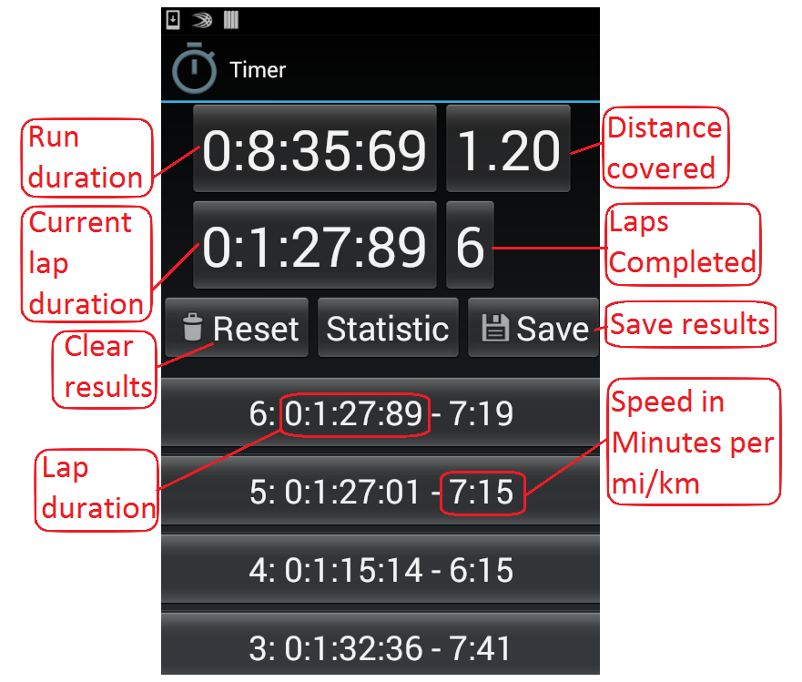
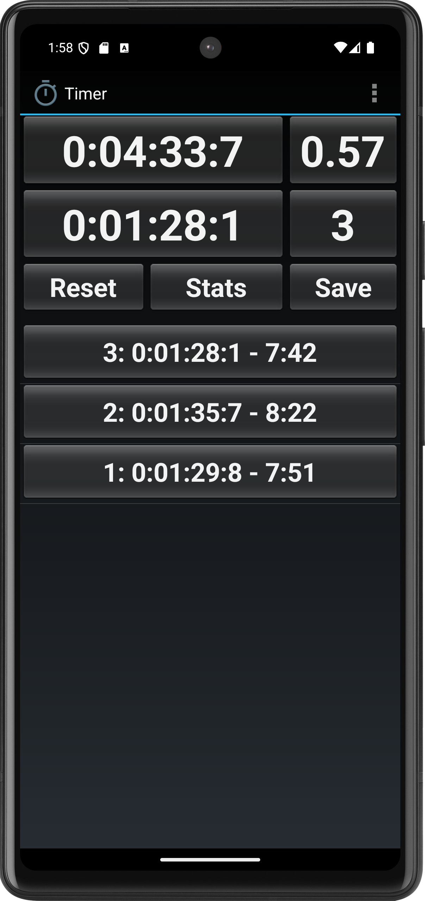
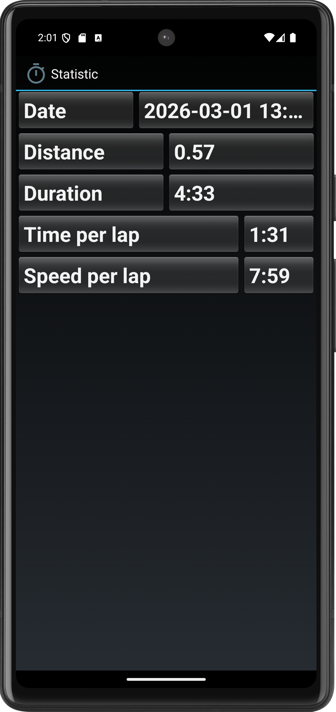
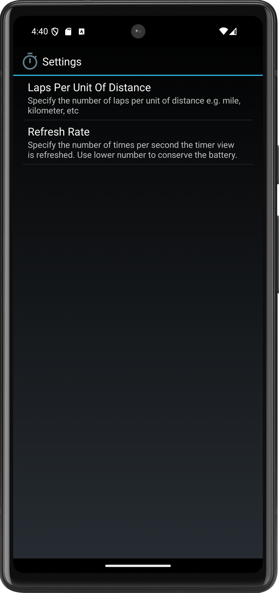
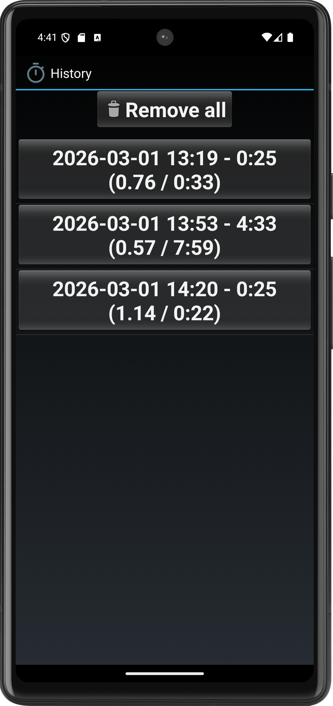

# Android Timer

**Android Timer** is a run timer application for *Android* with the following features:

* Uses *volume button DOWN* to start a new lap (or resume a run) and *volume button UP* to stop a run.
* Shows run duration, current lap duration, number of laps completed and distance covered.
* Shows the list of completed laps with the duration and the speed for each lap.
* Provides ability to remove any lap with its duration transferred to the next lap.
* Includes the runs history with ability to resume any run saved.
* Allows to configure a number of laps per unit of distance e.g. mile, kilometer, etc.
* Shows the statistic for a current run in progress or a saved run.

## Run / laps
Main screen showing total run and current lap duration, total distance covered 
(based on the configuration), run controls and laps completed.

## Statistic
Statistic screen showing current run statistic.

## Settings
Settings screen allows to configure laps per unit of distance and refresh rate.

## History
History screen shows saved runs.

